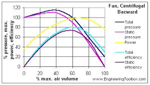
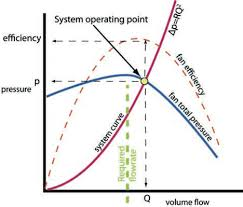
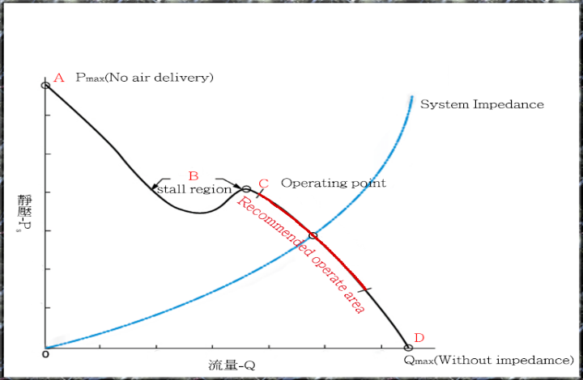
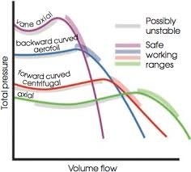

### INTRODUCTION 

#### Pitot Static Tube

 For every speed of a fan, a set of curve can be drawn to show variations of fan drift pressure, B. H. P. (Brake horse power) of the prime mover and mechanical efficiency of the fan, with the change in volume of air circulated by it. These curves are the indicative of the performance Or 'characteristics of the fan' and as such referred as fan characteristics curves of that particular fan. Sometimes the term "fan characteristics" is used to denote the pressure-volume curve.

Characteristics curve can be used:

<ol style="text-indent:50px;text-align:justify;list-style-position: inside;">
<li>To assess the efficiency of construction of a fan.</li>
<li>To compare two or more fan.</li>
<li>To choose the most efficient fan for a given mine resistance.</li>
<li>To anticipate change in performance of a fan with change in mine resistance.</li>
<li>To choose a prime mover of suitable power and type.</li>
<li>To know the performance of a combination of fans in series or in parallel, by compounding curves of the individual fans.</li>
</ol>

Characteristics curve for various type of fans:

<ol style="text-indent:50px;text-align:justify;list-style-position: inside;">
<li>
The pressure characteristics or the pressure volume curve of a backward bladed fan falls fairly steadily from a maximum pressure at low volume to zero at maximum pressure at low volume to zero at volume, while that of a forward bladed fan remains fairly constant for a wide range of volume but falls steeply as maximum volume is reached.
In case of axial flow fan maximum water gauge is developed at zero volume and not at the low volume as in the other two cases.

</li>
<li>
The power characteristics or the B.H.P curve of a backward bladed fan is almost a rising straight line passing above the origin, tending to flatten and then to fall with increasing volume, thereby showing that power increases with increase of volume, but as maximum volume is approached, power becomes almost constant and the decreases. Thus it indicate the non-overloading feature backward bladed.

Power characteristics of a forward bladed fan rises steadily at low volume but steepens at high volumes, so that is for any region the mine resistance decreases i.e if the volume of air flowing increases ,the motor will be overloaded. Hence an electric drive is unsuitable for a forward blading centrifugal fan, when there a chances of sudden short circuiting are sudden change in mine resistance.

</li>
<li>
The efficiency characteristics of radial flow fan of both forward and backward bladed time is a symmetrical curve rising steeply from zero at zero volume to a broad topped maximum and falling again steeply to zero at maximum volume.

Efficiency characteristics of axial flow fan differs markedly from the other two type. It shows the general rise in efficiency from zero to sharp peak followed by a rapid drop. It indicates that this fan suitable only in mine whose resistance varies within fairly narrow limits.

A mine characteristic is a curve showing the pressure quantity relationship of the mine, that is, it indicates what quantity of air will pass through the mine when the given pressure is applied across the mine opening, or vice versa. It is the curve of equation P=RQ2, where R is the resistance of the mine. Such curve for a roadway is called characteristic curve of that roadway.

The point of intersection of the mine characteristic with the pressure volume curve of the mine, when the two are plotted on the same scale, gives an " operating point" which indicates the pressure and volume for which the fan would the mechanically but suited. If the corresponding efficiency figure lies near the apex of the efficiency curve, the fan will work efficiently and economically.

Mine characteristic curves corresponding to resistances, which the mine is anticipated to have during the whole life(for at least a major of it) of the mine can be drawn and it is can be drawn and it can be seen whether the fan will work efficiently and economically under the changing conditions. If necessary, a new set of curves for a different fan speed, fan blading or guide vane setting can be drawn to get satisfactory operating points.

For a developing mine, the operating point should be preferably lie to the left of the peak of efficiency curve, so that as the mine is developed, the resulting increases in quantity will shift the operating point to the right, that is, to the peak of the efficiency curve.

In all types of fan,the operating point should be fixed to the right of the aerodynamic " stall point " which is the point of reverse flexure, for at capacities less than this performance of the fan becomes unstable and there occurs fluctuation of air velocity characterized by throbbing and noise.

</li>
</ol>

  

Characteristics curve of a backward blade centrifugal fan.
 

Source: (<a href="https://www.engineeringtoolbox.com/fan-types-d_142.html">https://www.engineeringtoolbox.com/fan-types-d_142.html
</a>)

  

  

Curve representing operating point.
 

Source: (<a href="https://www.axair-fans.co.uk/all-technical-information/duty-point-operating-point/">https://www.axair-fans.co.uk/all-technical-information/duty-point-operating-point/
</a>)

  

  

Characteristics curve showing stall region.
 

Source: (<a href="http://www.honsan-tech.com.tw/Web/EN/Technical%20Information_Impedance%20Curve-en1.html">http://www.honsan-tech.com.tw/Web/EN/Technical%20Information_Impedance%20Curve-en1.html
</a>)

  

  

Characteristics curve of different fan.
 

Source: (<a href="https://www.cibsejournal.com/cpd/modules/2011-12/">https://www.cibsejournal.com/cpd/modules/2011-12/
</a>)

 